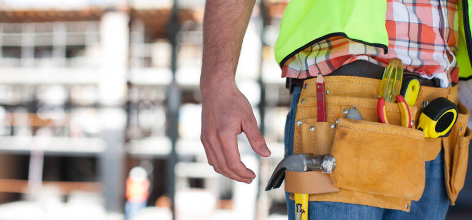



	

		

			
			
Termomodernizacja i modernizacje od 1998 roku

			<a href="no-sidebar.html" class="button style1">Zobacz nasze realizacje</a>
		

	

				<section id="intro" class="wrapper style1">
					
Wizja

					

						
Działamy na rynku termomodernizacji od 1998 r.

						

							Sprawdź, dlaczego od ponad 25 lat  
							klienci wybierają właśnie nas
						

						
Anwibud to rodzinna firma z <strong>Włocławka</strong>. 
						Chcemy zmieniać otaczającą przestrzeń, tworząc trwałe, estetyczne i energooszczędne budynki.
						Naszym celem jest być zaufanym partnerem dla wspólnot, spółdzielni i instytucji w całej <strong>Polsce</strong>, 
						oferując kompleksowe i rzetelne rozwiązania w zakresie termomodernizacji oraz modernizacji budynków.
						Stawiamy na rozwój zespołu, nowoczesne technologie i jakość, która realnie poprawia <strong>komfort życia mieszkańców</strong>.

					

				</section>
				<section id="highlights" class="wrapper style3">
					
Czym się zajmujemy

					

						

							

								<section class="highlight">
									
									<h3><a href="#">Prace ogólnobudowlane</a></h3>
									
Wykonujemy remonty klatek schodowych, montaż balustrad, układanie płytek i inne prace wykończeniowe.
									Działamy sprawnie, z poszanowaniem przestrzeni wspólnych i życia mieszkańców.
									Dbamy o trwałość, estetykę i funkcjonalność w każdej realizacji.

								</section>
							

							

								<section class="highlight">
									
									<h3><a href="#">Termomodernizacja budynków</a></h3>
									
Zajmujemy się kompleksowym dociepleniem elewacji, stropów i dachów.
									Nasze prace poprawiają nie tylko estetykę budynku, ale też realnie obniżają koszty ogrzewania.
									Współpracujemy z renomowanymi dostawcami materiałów i gwarantujemy jakość na lata.

									<ul class="actions">
										<li><a href="right-sidebar.html" class="button style1">Dowiedz się więcej</a></li>
									</ul>
								</section>
							

							

								<section class="highlight">
									
									<h3><a href="#">Niestandardowe realizacje</a></h3>
									
Podejmujemy się złożonych zadań - 
									Nasze doświadczenie pozwala na realizację projektów wymagających precyzji i koordynacji.
									Nie boimy się wyzwań — szukamy rozwiązań tam, gdzie inni widzą tylko trudności.

								</section>
							

						

					

				</section>
				<section id="main" class="wrapper style2">
					
O nas

					

							
							<section id="features">
								<header class="style1">
									<h2>Dlaczego klienci wybierają Anwibud?</h2>
									
Od ponad 25 lat rozwijamy się razem z naszymi klientami, budując markę opartą na doświadczeniu, jakości i zaufaniu.

								</header>
								

									

										

											<section>
												<h3 class="icon fa-building">Z troską o otoczenie</h3>
												
Dbamy o rzetelność, terminowość i kontakt z mieszkańcami na każdym etapie prac.
												Dzięki temu nasze realizacje przebiegają sprawnie i z poszanowaniem codziennego rytmu życia całej wspólnoty.

											</section>
										

										

											<section>
												<h3 class="icon solid fa-sync">Działamy kompleksowo i niezależnie</h3>
												
Mamy własne rusztowania, sprzęt i transport – nie korzystamy z podwykonawców. Mamy pełną kontrolę nad jakością, terminami i każdym etapem realizacji. 

											</section>
										

										

											<section>
												<h3 class="icon solid fa-users">Doświadczony i zgrany zespół</h3>
												
Przez lata stworzyliśmy zgrany i doświadczony zespół ponad 50 osób. Każdy z nas wnosi profesjonalizm i zaangażowanie do realizowanych projektów. 

											</section>
										

										

											<section>
												<h3 class="icon solid fa-globe">Działamy w całej Polsce</h3>
												
Realizujemy inwestycje na terenie całej Polski: Włocławek, Łódź, Gdańsk, Gdynia, Płock, Toruń i wiele innych miast.

											</section>
										

										

											<section>
												<h3 class="icon solid fa-calendar">Od początku do końca</h3>
												
Prowadzimy pełną opiekę nad projektem – od planowania po realizację. Zapewniamy spójność, porządek i terminowość

											</section>
										

										

											<section>
												<h3 class="icon solid fa-check">Jakość potwierdzona referencjami</h3>
												
Jakość to dla nas podstawa – i potwierdzają to liczne referencje od inwestorów publicznych, prywatnych oraz deweloperskich. Zaufali nam Ci, którzy wymagają najwięcej

											</section>
										

									

								

							</section>
					

				</section>

