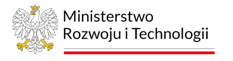



<section id="header" class="wrapper style2">
  

    <h1><a href="#">Termomodernizacja</a></h1>
    
Przyszłościowy kierunek łączący oszczędność, ekologię oraz komfort życia

  

</section>
<section id="main" class="wrapper style2">
  
Efektywność energetyczna

  

    

      

        

          <article class="box post">
            <header class="style1">
              <h2>Termomodernizacja poprawia izolację budynku i zmniejsza zużycie energii na ogrzewanie.</h2>
              
Mniej strat, więcej oszczędności.

            </header>
            
            
Termomodernizacja to proces poprawy efektywności energetycznej budynków, obejmujący m.in. ocieplenie przegród zewnętrznych, wymianę stolarki okiennej i drzwiowej, modernizację systemu ogrzewania czy montaż odnawialnych źródeł energii. Jego celem jest zmniejszenie strat ciepła, a tym samym obniżenie kosztów eksploatacyjnych oraz poprawa komfortu użytkowania nieruchomości.

            
Prawidłowo przeprowadzona termomodernizacja przynosi realne oszczędności i wpływa na zmniejszenie emisji CO₂ do atmosfery. Inwestycja ta zwiększa również wartość rynkową budynku oraz jego żywotność. Dodatkowo pozwala dostosować obiekt do współczesnych norm energetycznych i ekologicznych. Coraz częściej stanowi też warunek uzyskania dofinansowania z programów krajowych i unijnych.

            
W ramach działań modernizacyjnych stosuje się m.in. płyty termoizolacyjne, wełnę mineralną, styropian, a także nowoczesne okna o niskim współczynniku przenikania ciepła. Kluczowe jest również dostosowanie systemu grzewczego do nowych parametrów energetycznych budynku — często oznacza to wymianę źródła ciepła na bardziej efektywne lub niskoemisyjne, jak pompa ciepła, kocioł gazowy czy system oparty na OZE.

            
Termomodernizacja to nie tylko poprawa komfortu termicznego — to także realny wpływ na środowisko naturalne oraz długofalowe korzyści finansowe. W czasach rosnących cen energii staje się nie luksusem, a koniecznością.

            
Ważnym elementem skutecznej termomodernizacji jest również profesjonalne doradztwo i opracowanie indywidualnego audytu energetycznego. Taki dokument pozwala ocenić faktyczne zapotrzebowanie budynku na energię, wskazać najbardziej opłacalne rozwiązania oraz precyzyjnie zaplanować kolejne etapy prac. Dzięki temu inwestor może podejmować decyzje w sposób świadomy, oparty na danych, a nie przypuszczeniach.

          </article>
          

            

              <section class="box">
                <header>
                  <h2>Ulga termomodernizacyjna w 2025</h2>
                </header>
                
                
Ulga termomodernizacyjna to odliczenie od podatku dochodowego przysługujące właścicielom lub współwłaścicielom domów jednorodzinnych...

                <a href="https://www.podatki.gov.pl/pit/ulgi-odliczenia-i-zwolnienia/ulga-termomodernizacyjna/" class="button style1">Dowiedz się więcej</a>
              </section>
            

            

              <section class="box">
                <header>
                  <h2>Dyrektywa EPBD</h2>
                </header>
                
                
Nowa dyrektywa EPBD przewiduje, że od 2030 r. wszystkie nowe budynki mają być zeroemisyjne...

                <a href="https://www.gov.pl/web/rozwoj-technologia/dyrektywa-w-sprawie-charakterystyki-energetycznej-budynkow-epbd" class="button style1">Dowiedz się więcej</a>
              </section>
            

          

        

      

      

        

                <section class="box">
											<header>
												<h2>Program Czyste Powietrze</h2>
											</header>
											
Ogólnopolski program dotacyjny, który wspiera właścicieli domów jednorodzinnych
												w wymianie starych źródeł ciepła i termomodernizacji budynków, 
												aby zmniejszyć koszty ogrzewania i poprawić jakość powietrza.

											<a href="https://czystepowietrze.gov.pl/" class="button style1">Dowiedz się więcej</a>
										</section>
										<section class="box">
											<header>
												<h2>Aktualności z branży</h2>
											</header>
											<ul class="style2">
												<li>
													<article class="box post-excerpt">
														
														<h3><a href="https://www.globenewswire.com/news-release/2025/04/23/3066199/28124/en/Pol
															and-Construction-Industry-Report-2025-Market-Opportunities-in-Polish-Construction-A-Detaile
															d-10-Year-Forecast.html?">Ożywienie w sektorze budowlanym: +5,1 % wzrost w 2025 r.</a></h3>
														
Według raportu ResearchAndMarkets wartość polskiego rynku budowlanego wzrośnie w 
															2025 r. o 5,1 %, osiągając około 54 mld EUR (~230 mld zł).

													</article>
												</li>
												<li>
													<article class="box post-excerpt">
														
														<h3><a href="https://www.czystepowietrze.eu/aktualnosci/program-czyste-powietrze-wraca-31-marca-2025-r">Nowa odsłona programu Czyste Powietrze</a></h3>
														
Zmodyfikowana wersja programu ruszyła 31 marca 2025 r. z uproszczonymi 
															zasadami, nowymi budżetami (do 170 000 zł) i zwiększonym wsparciem.

													</article>
												</li>
											</ul>
											<a href="https://www.muratorplus.pl/" class="button style1">Więcej aktualności</a>
										</section>
										<section class="box">
											<header>
												<h2>Nasi partnerzy</h2>
											</header>
											<ul class="style3">
												<li><a href="https://www.bolix.pl/pl/">Bolix - Jeden z liderów budowlanych w Polsce.</a></li>
												<li><a href="https://www.atlas.com.pl/">Atlas - Największy producent wyrobów chemii budowlanej w Polsce.</a></li>
												<li><a href="https://www.ceresit.pl/">Ceresit – Jedna z czołowych marek chemii budowlanej w Europie Wschodniej.</a></li>
												<li><a href="https://www.pik.plo.pl/">PiK - Wiodący dystrybutor chemii budowlanej.</a></li>
												<li><a href="https://tuplex.pl/">Tuplex - Lider rynku tworzyw sztucznych.</a></li>
												<li><a href="https://trops.pl/">Trops - Dystrybutor materiałów budowlanych, farb, narzędzi.</a></li>
												<li><a href="https://www.sig.pl/">Sig - Wiodący dystrybutor specjalistycznych materiałów budowlanych.</a></li>
												<li><a href="https://www.budrox.eu/">Budrox - Budownictwo ogólne, przemysłowe oraz energetyczne.</a></li>
												<li><a href="https://amtools.pl/">AM Tools - Sprzedaż narzędzi, elektronarzędzi i materiałów eksploatacyjnych.</a></li>
												<li><a href="https://www.masterplastgroup.pl/">MasterPlast - Dostawca materiałów budowlanych.</a></li>
											</ul>
									</section>
        

      

    

  

</section>

